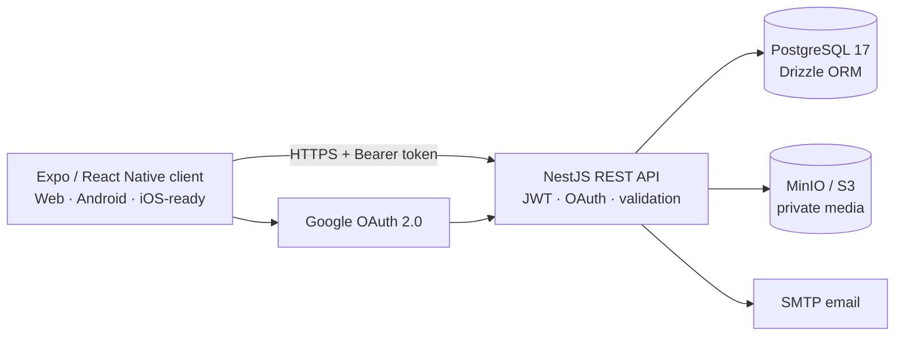

<p align="center">
  
</p>

<h1 align="center">HitTracker</h1>

<p align="center">
  A cross-platform workout planner and tracker for building programs, scheduling training and recording real workout results.
</p>

<p align="center">
  <a href="https://github.com/smmlt/hit-tracker-mobile/releases/latest"></a>
  
  
  
  
</p>

## Project links

| Area | Link | Purpose |
|---|---|---|
| Web app | [app.hit-tracker.com](https://app.hit-tracker.com) | Browser version of HitTracker |
| Mobile / frontend | [smmlt/hit-tracker-mobile](https://github.com/smmlt/hit-tracker-mobile) | Expo, React Native, Android, iOS-ready configuration and web client |
| Backend / API | [Igggosha/HITTrackerBackend](https://github.com/Igggosha/HITTrackerBackend) | NestJS API, PostgreSQL schema, migrations and Docker stack |
| Latest Android APK | [Download the latest release](https://github.com/smmlt/hit-tracker-mobile/releases/latest) | Recommended signed universal build |
| Release archive | [All Android releases](https://github.com/smmlt/hit-tracker-mobile/releases) | Historical APK builds and change notes |

> The public web and API endpoints currently depend on the project's development infrastructure and may be unavailable while the host machine is offline.

## What HitTracker does

- Email registration, verification, password recovery and Google OAuth.
- Personal profiles, body metrics and profile photos.
- Exercise catalogue with muscles, likes and bookmarks.
- Official and personal workout programs with a reusable library.
- Calendar scheduling and weekly training plans.
- Active workouts with sets, repetitions, weight, timers, pause and resume.
- Completed workout history and progress data.
- Moderator tools for users, exercises and official content.
- English and Ukrainian interface, light and dark themes.

## Architecture



The frontend and backend remain independent repositories. This repository is the stable project entry point and documentation hub; it intentionally does not duplicate their source code.

## Technology stack

### Client

- React 19, React Native 0.86 and Expo SDK 57
- React Navigation, Expo SecureStore and AsyncStorage
- React Native SVG, WebView, charts and video
- Android Studio / Gradle local release builds
- Nginx for the exported web application

### Server

- Node.js, TypeScript and NestJS 11
- Drizzle ORM and PostgreSQL 17
- JWT access/refresh sessions, Passport and Google OAuth 2.0 with PKCE
- MinIO-compatible S3 storage and Sharp image processing
- SMTP mail, validation, throttling and Helmet

### Infrastructure

- Docker Compose for API, database, migrations, seed data, MinIO and web
- Optional Cloudflare Tunnel for public development endpoints
- GitHub Releases for versioned Android artifacts

## Android

The recommended APK is a universal signed build for Android 7.0 and newer. It includes `armeabi-v7a`, `arm64-v8a`, `x86` and `x86_64`, so the same file can run on supported phones and Android emulators.

- [Download Build 4 (latest)](https://github.com/smmlt/hit-tracker-mobile/releases/latest)
- [Compare all builds and checksums](docs/RELEASES.md)

Builds 1–3 used earlier signing credentials. Install Build 4 as a clean installation once; future releases signed with the permanent HitTracker key can update it in place.

## Local development

Clone the two implementation repositories as sibling directories:

```text
HitTracker/
├── hit-tracker-mobile/
└── hit-tracker-backend/
```

Each implementation repository contains its own setup and local-development instructions.

## Project status

HitTracker is an actively developed diploma project. Core authentication, profiles, exercise and program libraries, workout scheduling, active sessions, history and moderator flows are implemented. Analytics and production hosting remain active development areas.

See the [project roadmap](docs/ROADMAP.md), including the planned migration to a true monorepo after the current release workflow is stable.

## License

No open-source license has been granted yet. The source remains subject to the repository owners' rights until a license is added explicitly.
