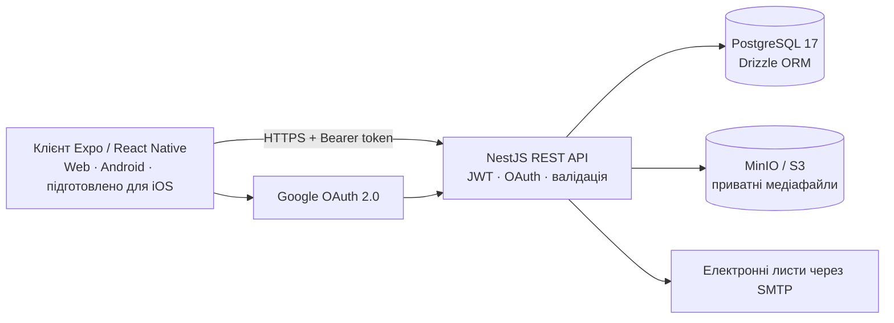

<p align="center">
  
</p>

<h1 align="center">HitTracker</h1>

<p align="center">
  <a href="README.md">English</a> · <strong>Українська</strong>
</p>

<p align="center">
  Кросплатформний планувальник і трекер тренувань для створення програм, складання розкладу та запису фактичних результатів.
</p>

<p align="center">
  <a href="https://github.com/smmlt/HitTracker/releases/latest"></a>
  
  
  
  
</p>

## Посилання проєкту

| Розділ | Посилання | Призначення |
|---|---|---|
| Вебзастосунок | [app.hit-tracker.com](https://app.hit-tracker.com) | Браузерна версія HitTracker |
| Мобільний клієнт / frontend | [smmlt/hit-tracker-mobile](https://github.com/smmlt/hit-tracker-mobile) | Expo, React Native, Android, підготовлена конфігурація iOS і вебклієнт |
| Backend / API | [Igggosha/HITTrackerBackend](https://github.com/Igggosha/HITTrackerBackend) | NestJS API, схема PostgreSQL, міграції та Docker-оточення |
| Останній Android APK | [Завантажити останній реліз](https://github.com/smmlt/HitTracker/releases/latest) | Рекомендована підписана універсальна збірка |
| Архів релізів | [Усі Android-релізи](https://github.com/smmlt/hit-tracker-mobile/releases) | Попередні APK-збірки та описи змін |

> Публічні веб- та API-адреси наразі залежать від інфраструктури розробки й можуть бути недоступними, коли головний комп'ютер вимкнений.

## Можливості HitTracker

- Реєстрація електронною поштою, підтвердження, відновлення пароля та Google OAuth.
- Особисті профілі, показники тіла та фотографії профілю.
- Каталог вправ із м'язами, вподобаннями та закладками.
- Офіційні й особисті програми тренувань зі спільною бібліотекою.
- Календарне планування та тижневі плани тренувань.
- Активні тренування з підходами, повтореннями, вагою, таймерами, паузою та продовженням.
- Історія завершених тренувань і дані про прогрес.
- Інструменти модератора для користувачів, вправ та офіційного контенту.
- Англійський та український інтерфейс, світла й темна теми.

## Архітектура



Frontend і backend залишаються незалежними репозиторіями. Цей репозиторій є стабільною точкою входу та центром документації проєкту й навмисно не дублює їхній вихідний код.

## Технології

### Клієнт

- React 19, React Native 0.86 та Expo SDK 57
- React Navigation, Expo SecureStore та AsyncStorage
- React Native SVG, WebView, графіки й відео
- Локальні release-збірки через Android Studio / Gradle
- Nginx для експортованого вебзастосунку

### Сервер

- Node.js, TypeScript та NestJS 11
- Drizzle ORM та PostgreSQL 17
- JWT access/refresh sessions, Passport і Google OAuth 2.0 з PKCE
- S3-сумісне сховище MinIO та обробка зображень через Sharp
- SMTP-пошта, валідація, обмеження частоти запитів і Helmet

### Інфраструктура

- Docker Compose для API, бази даних, міграцій, початкових даних, MinIO та вебзастосунку
- Опціональний Cloudflare Tunnel для публічних адрес середовища розробки
- GitHub Releases для версійних Android-артефактів

## Android

Рекомендований APK — універсальна підписана збірка для Android 7.0 і новіших версій. Вона містить `armeabi-v7a`, `arm64-v8a`, `x86` та `x86_64`, тому один файл працює на підтримуваних телефонах і Android-емуляторах.

- [Завантажити v1.2.5 · Build 16](https://github.com/smmlt/HitTracker/releases/latest/download/HitTracker-Android-v1.2.5-build16-universal.apk)
- [Порівняти всі збірки та контрольні суми](docs/RELEASES.uk.md)

Build 1–3 використовували попередні облікові дані для підпису. Один раз установіть Build 4 як чисту інсталяцію; наступні релізи з постійним ключем HitTracker зможуть оновлювати його без видалення застосунку.

## Локальна розробка

Клонуйте два репозиторії з реалізацією як сусідні каталоги:

```text
HitTracker/
├── hit-tracker-mobile/
└── hit-tracker-backend/
```

Кожен репозиторій містить власні інструкції з налаштування та локальної розробки.

## Стан проєкту

HitTracker — дипломний проєкт, який активно розвивається. Основні сценарії автентифікації, профілів, бібліотек вправ і програм, планування тренувань, активних сесій, історії та модерації вже реалізовані. Аналітика та постійний production-хостинг залишаються напрямами активної розробки.

Перегляньте [roadmap проєкту](docs/ROADMAP.uk.md), зокрема запланований перехід до справжнього monorepo після стабілізації поточного процесу випуску версій.

## Ліцензія

Ліцензію з відкритим вихідним кодом ще не надано. Вихідний код залишається захищеним правами власників репозиторіїв, доки ліцензію не буде додано явно.
